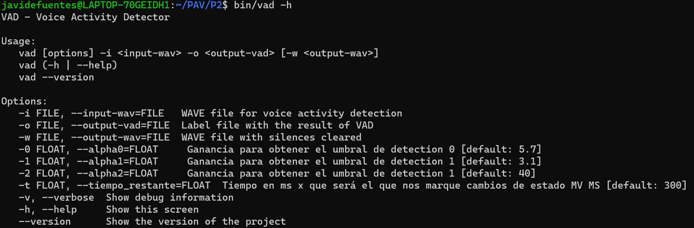

PAV - P2: detección de actividad vocal (VAD)
============================================

Esta práctica se distribuye a través del repositorio GitHub [Práctica 2](https://github.com/albino-pav/P2),
y una parte de su gestión se realizará mediante esta web de trabajo colaborativo.  Al contrario que Git,
GitHub se gestiona completamente desde un entorno gráfico bastante intuitivo. Además, está razonablemente
documentado, tanto internamente, mediante sus [Guías de GitHub](https://guides.github.com/), como
externamente, mediante infinidad de tutoriales, guías y vídeos disponibles gratuitamente en internet.


Inicialización del repositorio de la práctica.
----------------------------------------------

Para cargar los ficheros en su ordenador personal debe seguir los pasos siguientes:

*	Abra una cuenta GitHub para gestionar esta y el resto de prácticas del curso.
*	Cree un repositorio GitHub con el contenido inicial de la práctica (sólo debe hacerlo uno de los
	integrantes del grupo de laboratorio, cuya página GitHub actuará de repositorio central del grupo):
	-	Acceda la página de la [Práctica 2](https://github.com/albino-pav/P2).
	-	En la parte superior derecha encontrará el botón **`Fork`**. Apriételo y, después de unos segundos,
		se creará en su cuenta GitHub un proyecto con el mismo nombre (**P2**). Si ya tuviera uno con ese 
		nombre, se utilizará el nombre **P2-1**, y así sucesivamente.
*	Habilite al resto de miembros del grupo como *colaboradores* del proyecto; de este modo, podrán
	subir sus modificaciones al repositorio central:
	-	En la página principal del repositorio, en la pestaña **:gear:`Settings`**, escoja la opción 
		**Collaborators** y añada a su compañero de prácticas.
	-	Éste recibirá un email solicitándole confirmación. Una vez confirmado, tanto él como el
		propietario podrán gestionar el repositorio, por ejemplo: crear ramas en él o subir las
		modificaciones de su directorio local de trabajo al repositorio GitHub.
*	En la página principal del repositorio, localice el botón **Branch: master** y úselo para crear
	una rama nueva con los primeros apellidos de los integrantes del equipo de prácticas separados por
	guion (**fulano-mengano**).
*	Todos los miembros del grupo deben realizar su copia local en su ordenador personal.
	-	Copie la dirección de su copia del repositorio apretando en el botón **Clone or download**.
		Asegúrese de usar *Clone with HTTPS*.
	-	Abra una sesión de Bash en su ordenador personal y vaya al directorio **PAV**. Desde ahí, ejecute:

		```.sh
		git clone dirección-del-fork-de-la-práctica
		```

	-	Vaya al directorio de la práctica `cd P2`.
	-	Añada la etiqueta `origin` a su copia del repositorio. Esto es útil para facilitar los *push* y
		*pull* al repositorio original:
		```.sh
		git remote add origin dirección-del-fork-de-la-práctica
		```
	-	Cambie a la rama **fulano-mengano** con la orden:

		```.sh
		git checkout fulano-mengano
		```

*	A partir de este momento, todos los miembros del grupo de prácticas pueden trabajar en su directorio
	local del modo habitual.
	-	También puede utilizar el repositorio remoto como repositorio central para el trabajo colaborativo
		de los distintos miembros del grupo de prácticas; o puede serle útil usarlo como copia de
		seguridad.
	-	Cada vez que quiera subir sus cambios locales al repositorio GitHub deberá confirmar los
		cambios en su directorio local:

		```.sh
		git add .
		git commit -m "Mensaje del commit"
		```

		y, a continuación, subirlos con la orden:

		```.sh
		git push -u origin fulano-mengano
		```

*	Al final de la práctica, la rama **fulano-mengano** del repositorio GitHub servirá para remitir la
	práctica para su evaluación utilizando el mecanismo *pull request*.
	-	Vaya a la página principal de la copia del repositorio y asegúrese de estar en la rama
		**fulano-mengano**.
	-	Pulse en el botón **New pull request**, y siga las instrucciones de GitHub.


Entrega de la práctica.
-----------------------

Responda, en este mismo documento (README.md), los ejercicios indicados a continuación. Este documento es
un fichero de texto escrito con un formato denominado _**markdown**_. La principal característica de este
formato es que, manteniendo la legibilidad cuando se visualiza con herramientas en modo texto (`more`,
`less`, editores varios, ...), permite amplias posibilidades de visualización con formato en una amplia
gama de aplicaciones; muy notablemente, **GitHub**, **Doxygen** y **Facebook** (ciertamente, :eyes:).

En GitHub. cuando existe un fichero denominado README.md en el directorio raíz de un repositorio, se
interpreta y muestra al entrar en el repositorio.

Debe redactar las respuestas a los ejercicios usando Markdown. Puede encontrar información acerca de su
sintáxis en la página web [Sintaxis de Markdown](https://daringfireball.net/projects/markdown/syntax).
También puede consultar el documento adjunto [MARKDOWN.md](MARKDOWN.md), en el que se enumeran los
elementos más relevantes para completar la redacción de esta práctica.

Recuerde realizar el *pull request* una vez completada la práctica.

Ejercicios
----------

### Etiquetado manual de los segmentos de voz y silencio

- Etiquete manualmente los segmentos de voz y silencio del fichero grabado al efecto. Inserte, a 
  continuación, una captura de `wavesurfer` en la que se vea con claridad la señal temporal, el contorno de
  potencia y la tasa de cruces por cero, junto con el etiquetado manual de los segmentos.

> 

- A la vista de la gráfica, indique qué valores considera adecuados para las magnitudes siguientes:

	* Incremento del nivel potencia en dB, respecto al nivel correspondiente al silencio inicial, para
	  estar seguros de que un segmento de señal se corresponde con voz.

	   >Tal y como se observa en la gráfica, un incremento alrededor de los 20 dB garantiza el cambio de silencio a voz

	* Duración mínima razonable de los segmentos de voz y silencio.

	>Dado que la sección del audio con más naturalidad a la hora de hablar es la del final (el audio está adjunto en la carpeta de la práctica, se hizo de esa forma para poder separar los segmentos de una forma más precisa), podemos observar que los tramos de voz tienen una longitud aporximada de 500-800 ms, mientras que los del silnecio son más cortos, alrededor de los 100ms

	* ¿Es capaz de sacar alguna conclusión a partir de la evolución de la tasa de cruces por cero?
	
	>Se observa como en los tramos de voz, los picos son más elevados, lo que significa que la tasa de cruces por cero es menor. Tamvién se puede observar que en los sonidos fricativos, en nuestro caso la`f` de la palabra definitivo, se alcanza un máximo, mientras para sonidos oclusivos, en los que se la boca cierra el paso del aire, el valor es mucho menor.


### Desarrollo del detector de actividad vocal

- Complete el código de los ficheros de la práctica para implementar un detector de actividad vocal tan
  exacto como sea posible. Tome como objetivo la maximización de la puntuación-F `TOTAL`.

  >Nuestro detector de voz consiste en un algoritmo que varia entre 5 estados, `ST_INIT`,`ST_SILENCE`, `ST_VOICE`, `ST_MAYBE_VOICE`, `ST_MAYBE_SILENCE`

  >`ST_INIT`: Este estado es el inicial. Primeramente, inicializa dos variables necesarias como son k0 y k1 y posteriormente cambia de estado al estado silencio.

  >`ST_SILENCE`: Este estado indica silencio en el tramo. Cuando la potencia de voz del tramo es inferior al parámetro k0 definido en el estado `ST_INIT`, el sistema se irá a este estado. 

  >`ST_VOICE`: Este estado indica voz en el tramo. Cuando la potencia es superior al parámetro k0, el sistema se irá a este estado

  >`ST_MAYBE_VOICE`: Este estado se da cuando estamos en el estado de silencio y en el tramo la potencia del señal supera el umbral k0.
  Si la potencia supera el umbral k1 antes del parámetro de tiempo tiempo_restante, significa que en efecto el tramo es de voz y el sistema dará paso al estado ST_VOICE

  > `ST_MAYBE_SILENCE`: Este estado se da cuando estamos en el estado de voz y en el tramo la potencia del señal supera el umbral k0.
  Para detectar si estamos en silencio, el sistema mira si durante el tramo de tiempo tiempo_restante, la tasa de cruces por cero supera el umbral zcr_umbral, lo cual nos indica que, al ser una señal con poca potencia de voz ya que pasa muchas veces por 0, será un silencio
  

- Inserte una gráfica en la que se vea con claridad la señal temporal, el etiquetado manual y la detección
  automática conseguida para el fichero grabado al efecto. 

> 

- Explique, si existen. las discrepancias entre el etiquetado manual y la detección automática.

	>Podemos observar que si bien es cierto que los resultados obtenidos por nuestro algoritmo (transcription.vad) se asemejan mucho a los creados manualmente por nosotros a partir de la señal de audio (transcription.lab), en el tramo de voz nuestro algoritmo detecta estados de voz y silencio cuando realmente estamos diciendo un conjunto de palabras rápidamente sin pausas internas.

- Evalúe los resultados sobre la base de datos `db.v4` con el script `vad_evaluation.pl` e inserte a 
  continuación las tasas de sensibilidad (*recall*) y precisión para el conjunto de la base de datos (sólo
  el resumen).

> 

>A la vista de los resultados, observamos que de las voces que hay reconocemos el 93,23%, y de las voces que hemos detectado 79,79% son correctos.
>En cambio, de todos los silencios que hay, detectamos el 86,67% mientras que 89% de estos son correctos.

>Si bien es cierto que tenemos una buena precisión de voz, la verdad es que su recall no es demasiado alto, mientras que en el silencio la precisión y el recall están más equilibrados

### Trabajos de ampliación

#### Cancelación del ruido en los segmentos de silencio

- Si ha desarrollado el algoritmo para la cancelación de los segmentos de silencio, inserte una gráfica en
  la que se vea con claridad la señal antes y después de la cancelación (puede que `wavesurfer` no sea la
  mejor opción para esto, ya que no es capaz de visualizar varias señales al mismo tiempo).

#### Gestión de las opciones del programa usando `docopt_c`

- Si ha usado `docopt_c` para realizar la gestión de las opciones y argumentos del programa `vad`, inserte
  una captura de pantalla en la que se vea el mensaje de ayuda del programa.



### Contribuciones adicionales y/o comentarios acerca de la práctica

- Indique a continuación si ha realizado algún tipo de aportación suplementaria (algoritmos de detección o 
  parámetros alternativos, etc.).

- Si lo desea, puede realizar también algún comentario acerca de la realización de la práctica que
  considere de interés de cara a su evaluación.


### Antes de entregar la práctica

Recuerde comprobar que el repositorio cuenta con los códigos correctos y en condiciones de ser 
correctamente compilados con la orden `meson bin; ninja -C bin`. El programa generado (`bin/vad`) será
el usado, sin más opciones, para realizar la evaluación *ciega* del sistema.
